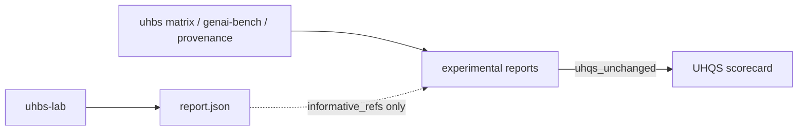

# Architecture: Experimental Benchmark Extensions

Informative add-ons under UHBS 4.5.x. Normative UHQS math remains in `uhbs_core.uhqs_math`.

## Surfaces

1. **Matrix** — five dimensions; equal-weight composite over *present* scores only; missing stays missing.
2. **GenAI/MCP** — CLR, SCR, TTFT; CI uses deterministic replay buffers; tarpit TPS does not auto-penalize high TTFT.
3. **Provenance** — collector-neutral JSONL; rate-limit/aggregate before SHA-256; optional signed envelopes are follow-up.
4. **OT** — harden Modbus/S7; expand BACnet/MQTT/CoAP with timeouts and strict frames.

See RFC 0002 and `docs/experimental/`.
